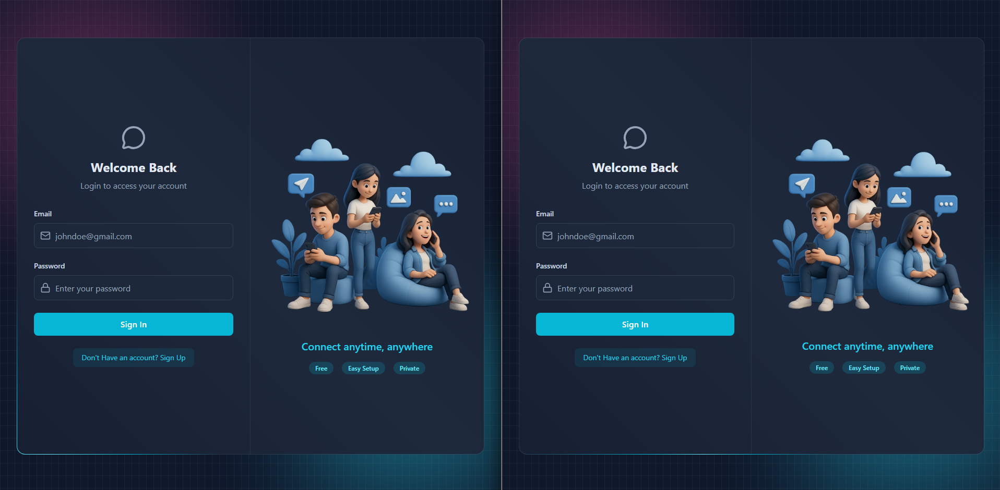

# 💬 YaP - Realtime Chat Application

A modern, full-stack real-time messaging application built with the **MERN** stack. Features instant messaging, live user status updates, and a sleek, glassmorphic UI powered by TailwindCSS and DaisyUI.




Watch Live Demo : https://www.linkedin.com/posts/abhishekyaaddv_mernstack-reactjs-socketio-activity-7418994060532690946-xhRA?utm_source=share&utm_medium=member_desktop&rcm=ACoAAEqVf3ABHWe6TWfrWmuKhvdWDAbjb6jvuC8


## 🚀 Features

- **Real-time Messaging:** Instant message delivery using **Socket.io**.
- **Live Status:** Real-time Online/Offline user status updates.
- **Authentication:** Secure JWT-based signup and login system.
- **Global State Management:** Seamless state handling with **Zustand**.
- **Modern UI/UX:**
  - Glassmorphism design aesthetics.
  - Responsive layout for desktop and mobile.
  - TailwindCSS + DaisyUI components.
- **Image Sharing:** Support for sending images in chats.
- **Sound Effects:** Interactive UI sounds for messages and interactions.

## 🛠️ Tech Stack

**Frontend:**
- 
- 
- 
- **Zustand** (State Management)
- **Lucide React** (Icons)

**Backend:**
- 
- 
- 

**Database:**
- 

## ⚙️ Installation & Setup

Follow these steps to run the project locally.

### 1. Clone the repository
```bash
git clone [https://github.com/Abhishekyaddv/YaP---Realtime-Chat-Aplication.git](https://github.com/Abhishekyaddv/YaP---Realtime-Chat-Aplication.git)
cd YaP---Realtime-Chat-Aplication

# Install backend dependencies
cd backend
npm install

# Install frontend dependencies
cd frontend
npm install


USE these enviroment variables as examples
PORT=5001
MONGO_URI=your_mongodb_connection_string
JWT_SECRET=your_jwt_secret_key
NODE_ENV=development

AFTER SETUP RUN THESE COMMANDS
Terminal 1 (Backend):
Bash
npm run server

Terminal 2 (Frontend):
Bash
cd client
npm run dev


📂 Project Structure
├── backend/
│   ├── controllers/     # Route controllers (Auth, Message)
│   ├── models/          # Mongoose models (User, Message)
│   ├── routes/          # API routes
│   ├── middleware/      # Auth middleware
│   ├── lib/             # Utilities (Socket.io, DB connection)
├── client/
│   ├── src/
│   │   ├── components/  # Reusable UI components
│   │   ├── store/       # Zustand store (Auth, Chat)
│   │   ├── pages/       # Page views (Home, Login, Signup)
│   │   ├── lib/         # Axios instance, utils


👤 Author
Abhishek Yadav
GitHub: @Abhishekyaddv
LinkedIn: https://www.linkedin.com/in/abhishekyaaddv/

⭐️ Star this repo if you found it useful!
